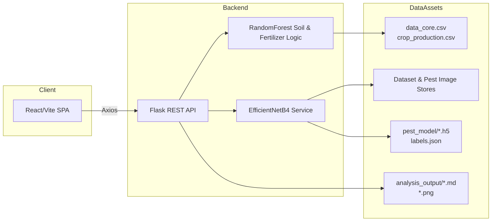
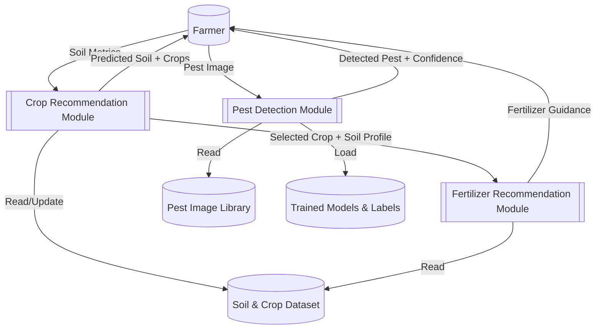

## Agricultural Pest Detection System – Detailed Report

### 1. Introduction
- **Project Name:** AI-Powered Agricultural Assistant  
- **Objective:** Deliver a unified platform for crop recommendation, fertilizer guidance, and pest identification using classical ML plus deep transfer learning.  
- **Core Components:** React/Vite frontend, Flask backend, RandomForest soil model, EfficientNetB4 pest detector, analytical assets under `backend/analysis_output/`.

### 2. End-to-End Workflow
1. **User Interaction (Frontend)**
   - Farmers enter soil/environment metrics, request crop/fertilizer suggestions, and upload pest images via `frontend/src/App.jsx`.
   - Axios wrappers in `frontend/src/api.js` call the REST API at `http://localhost:5000`.
2. **API Layer (Flask)**
   - `backend/app.py` exposes `/recommend_crops`, `/recommend_fertilizer`, `/detect_pest`, `/detect_pest_detailed`, `/pest_classes`, `/model_info`, and `/health`.
   - Input validation, error handling, and JSON responses keep the UI reactive.
3. **Crop & Fertilizer Intelligence**
   - `backend/model.py` loads `data_core.csv`, label-encodes soil/crop/fertilizer columns, and trains a `RandomForestClassifier` for soil prediction.
   - Nutrient levels are bucketed (Low/Medium/High) to filter viable crops and compute fertilizer closest to the user’s NPK profile.
4. **Pest Detection**
   - Uploaded images are converted to PIL, preprocessed, and passed to `PestDetector` in `backend/pest_model.py`.
   - Detector loads the latest `.h5` weights plus `labels.json` and returns top‑k confidences to the client.
5. **Analytics & Reporting**
   - `backend/generate_analysis.py` reads training logs/metrics and produces PNGs, CSVs, and Markdown summaries consumed in project documentation.

### 3. Technology Stack
- **Frontend:** React 19, Vite, Axios, CSS3/animations, ESLint.
- **Backend:** Python 3.11 (venv), Flask + Flask-CORS, Pandas/Numpy, Scikit-learn, TensorFlow/Keras, Pillow/OpenCV.
- **DevOps & Tooling:** npm scripts (`dev`, `build`, `lint`), pip `requirements.txt`, Windows `train.bat`, matplotlib/seaborn/plotly for analytics.
- **Documentation Assets:** `Software_Requirements_Specification.md`, `Technical_Architecture_Document.md`, `Project_Summary_Report.md`, architecture diagrams, confusion matrices, comparison tables.

### 4. Data & Datasets
- **Primary pest dataset:** `backend/dataset/` with 12 classes (ants → weevils) split into `train/` and `test/`.
- **Supplementary dataset:** `backend/pest/` with 9 additional pest categories for model diversification.
- **Tabular agronomy data:** `data_core.csv` and `crop_production.csv` feed the soil/crop/fertilizer logic.
- **Dataset diagnostics:** Class distributions, training curves, and confusion matrices stored under `backend/analysis_output/`.

### 5. Machine Learning Methods
#### 5.1 Soil & Fertilizer Recommendation
- **Label Encoding:** `LabelEncoder` used for soil, crop, and fertilizer categorical fields.
- **RandomForestClassifier:** Predicts soil type from temperature/humidity/moisture.
- **Rule-based nutrient tiers:** Converts numeric NPK values into qualitative buckets to match dataset rows.
- **Nearest-neighbor fertilizer selection:** Euclidean distance in NPK space chooses the closest fertilizer profile for the chosen crop.

#### 5.2 Pest Detection (Deep Learning)
- **Base Architecture:** EfficientNetB4 (`backend/optimized_model.py`) with input 380×380×3.
- **Transfer Learning Strategy:**
  - Load ImageNet weights via `keras.applications` and `get_file`.
  - Initially freeze the base network; train custom classifier head (global pooling → BN → dropout → dense residual blocks → softmax).
  - Fine-tune by unfreezing EfficientNet layers and recompiling with a lower learning rate.
- **Optimization:**
  - AdamW optimizer (weight decay 1e-4) with metrics `accuracy`, `SparseTopKCategoricalAccuracy` for k=3 and k=5.
  - Callbacks: `ModelCheckpoint`, `EarlyStopping`, `ReduceLROnPlateau`, `CSVLogger`.
  - Advanced augmentation pipeline (RandomRotation/Translation/Flip/Zoom, brightness & contrast jitter, Gaussian noise, RandomCrop, RandomCutout).
- **Training Pipeline (`backend/train_optimized.py`):**
  - Aggregates multiple directories via `tf.keras.utils.image_dataset_from_directory`.
  - Uses `tf.data.AUTOTUNE` prefetching for throughput.
  - Two-phase training (head → fine-tuning) with visualization and metric export (PNG + JSON).
- **Legacy/Alternative Model (`backend/train_pest.py`):**
  - MobileNetV2-based pipeline (224×224 inputs) leveraging `ImageDataGenerator` for environments needing lighter models.
  - Produces `pest_model_final.h5`, classification reports, confusion matrices, and class distribution charts.

### 6. EfficientNetB4 Highlights
- **Reason for Choice:** 19.3M parameters and excellent accuracy/performance trade-off versus MobileNetV2, ResNet50, or VGG16 (see `model_comparison.csv`).
- **Input Pipeline:** Rescaling + mean/variance normalization to match ImageNet preprocessing.
- **Classifier Head:** Two dense layers (1024, 512) with Swish activations, batch norm, dropout, and residual skip when dimensions align.
- **Performance Metrics (from `Project_Summary_Report.md`):**
  - Validation accuracy ≈ 92.1% after fine-tuning.
  - Inference latency ~45 ms, model size ~75 MB.
- **Outputs:** `pest_model/pest_model_best.h5`, `pest_model_final.h5`, `labels.json`, `class_mappings.json`, training logs, and visualizations consumed by the API/UI.

### 7. API Surface & Frontend Integration
| Endpoint | Purpose | Consumer |
| --- | --- | --- |
| `POST /recommend_crops` | Predict soil type + recommended crops | `submitCropRecommendation` in React |
| `POST /recommend_fertilizer` | Suggest fertilizer for selected crop | `submitFertilizerRecommendation` |
| `POST /detect_pest` | Single prediction (label, confidence) | Simple UI mode |
| `POST /detect_pest_detailed` | Top‑k predictions with confidences | “Detailed results” toggle |
| `GET /pest_classes` | Supply UI dropdown/class list | `loadPestClasses()` |
| `GET /model_info` | Report model status, class names, training summary | UI info panel |
| `GET /health` | Health probe for deployment | Monitoring scripts |
| `GET /training_visualizations/<file>` | Serve PNG analytics to dashboards | Optional |

Frontend steps:
1. **Step 1 – Crop recommendation:** gather user input, call `/recommend_crops`, display soil type and crop list.
2. **Step 2 – Fertilizer suggestion:** user picks a crop from recommended list, fetch fertilizer advice.
3. **Step 3 – Pest detection:** image upload + optional detailed checkbox triggers appropriate endpoint; results render as cards with confidence bars.

### 8. Deployment & Setup
- **Backend:**  
  ```bash
  cd backend
  python -m venv venv
  venv\Scripts\activate
  pip install -r requirements.txt
  python app.py  # serves API on http://0.0.0.0:5000
  ```
- **Frontend:**  
  ```bash
  cd frontend
  npm install
  npm run dev  # http://localhost:5173
  ```
- **Training:** run `train_optimized.py` (EfficientNetB4) or `train_pest.py` (MobileNetV2). A Windows helper `train.bat` activates the venv and launches optimized training.
- **Artifacts:** Generated models/metrics populate `backend/pest_model/`; analytic documents land in `backend/analysis_output/`.

### 9. Documentation & Reporting Assets
- `analysis_output/Project_Summary_Report.md`: executive summary, metrics tables, roadmap.
- `analysis_output/Technical_Architecture_Document.md`: architecture patterns, technology stack, security, deployment, monitoring.
- `analysis_output/Software_Requirements_Specification.md`: functional/non-functional requirements.
- PNG visualizations: training curves, learning-rate analysis, confusion matrices, system architecture diagrams.
- CSV tables: `model_comparison.csv`, `performance_metrics.csv`.

### 10. Future Enhancements & Considerations
- **Model Expansion:** add more pest classes, experiment with vision transformers or YOLO-based detection for localization.
- **Mobile & Edge:** quantize EfficientNetB4 or adopt MobileNet/EdgeTPU variants for offline/mobile deployment.
- **Cloud Deployment:** containerize Flask + React, add load balancers, and integrate object storage for datasets.
- **IoT Integration:** ingest live sensor data for automated crop/fertilizer updates.
- **Monitoring:** plug `/health` and training summaries into dashboards (Grafana/Prometheus) for continuous model ops.

### 11. Conclusion
The Agricultural Pest Detection System combines traditional ML and deep transfer learning to deliver actionable insights to farmers. EfficientNetB4-based pest recognition, RandomForest soil intelligence, and a modern React interface create an end-to-end workflow that is documented, testable, and extensible. This Markdown report aggregates the operational workflow, technology stack, transfer-learning strategy, EfficientNetB4 implementation, and supporting artifacts required for project reporting.

### 12. Visual Diagrams

#### 12.1 End-to-End Flowchart
```mermaid
flowchart TD
    A[Farmer Inputs Data / Image] --> B{Request Type?}
    B -->|Soil Metrics| C[POST /recommend_crops]
    C --> D[RandomForest Soil Prediction]
    D --> E[Crop Recommendations]
    E --> F[Frontend Step 2\nCrop Selection]
    F --> G[POST /recommend_fertilizer]
    G --> H[Fertilizer Recommendation]
    B -->|Pest Image| I[POST /detect_pest or /detect_pest_detailed]
    I --> J[PestDetector (EfficientNetB4)]
    J --> K[Pest Prediction + Confidence]
    H --> L[React UI Rendering]
    K --> L
    L --> M[Farmer Actions]
```

#### 12.2 High-Level Architecture Diagram


#### 12.3 Data Flow Diagram – Level 0 (Context)
```mermaid
graph TD
    Farmer[(Farmer)]
    System[[AI Agricultural Assistant]]
    ExternalDB[(External Data Sources\n(datasets, models))]
    Farmer -->|Soil Metrics / Pest Images| System
    System -->|Recommendations / Detections| Farmer
    System -->|Model Updates / Reports| ExternalDB
```

#### 12.4 Data Flow Diagram – Level 1


#### 12.5 Use Case Diagram
```mermaid
graph LR
    actor Farmer
    usecase UC1 as "Submit Soil Data"
    usecase UC2 as "View Crop Recommendations"
    usecase UC3 as "Request Fertilizer Advice"
    usecase UC4 as "Upload Pest Image"
    usecase UC5 as "View Pest Detection Results"
    usecase UC6 as "Check System Status"

    Farmer -- UC1
    Farmer -- UC2
    Farmer -- UC3
    Farmer -- UC4
    Farmer -- UC5
    Farmer -- UC6
```


